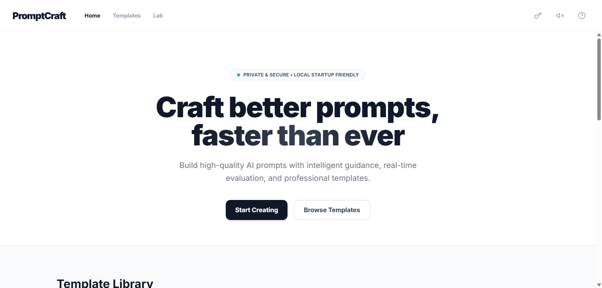

# PromptCraft

> Democratizing AI — a local-first prompt builder that helps everyday users craft high-quality, reproducible AI prompts without needing prompt engineering expertise.

**[Live Demo](https://kong-pd.github.io/PromptCraft/)**



---

## The Problem

Most people struggle to get consistent, useful results from AI tools. The quality of AI output depends heavily on how a prompt is written — a skill gap that leaves non-technical users behind.

## What PromptCraft Does

PromptCraft guides users through a structured prompt-building process, lowering the barrier to effective AI use through:

- **Template Library** — professionally designed prompt templates across common use cases
- **Structured Input** — guided fields that help users construct prompts with the right context, tone, and constraints
- **Real-time Quality Scoring** — instant feedback on prompt quality using a client-side scoring model
- **BYOK (Bring Your Own Key)** — users connect their own Google Gemini API key directly in the browser
- **Lab Mode** — experimental prompt testing and audio/visual generation features

## Privacy by Design

All user data and API keys are stored exclusively in the browser's `localStorage`. No data is transmitted to any server. A one-click **Clear Data** button lets users wipe all local storage at any time.

User's Browser
│
├── localStorage (API key, prompt history)
│
└── Google Gemini API (direct call, no proxy)

No backend. No tracking. No data collection.

---

## Tech Stack


| Layer | Technology |
|-------|-----------|
| Frontend | Vanilla HTML / CSS / JavaScript |
| AI Integration | Google Gemini API (client-side) |
| Audio/Visual | Web Audio API, HTML5 Audio |
| Storage | Browser localStorage only |
| Hosting | GitHub Pages |

---

## Getting Started

**No installation required.** Open the live demo directly in your browser:

**[https://kong-pd.github.io/PromptCraft/](https://kong-pd.github.io/PromptCraft/)**

To use AI generation features:
1. Visit [Google AI Studio](https://aistudio.google.com/app/apikey) to create a free Gemini API key
2. Click the key icon in the top-right corner of PromptCraft
3. Paste your API key, it is saved locally in your browser only
4. Start crafting prompts

To run locally:
```bash
git clone https://github.com/kong-pd/PromptCraft.git
cd PromptCraft
# Open index.html in your browser
```

---

## Architecture


---

## Project Background

PromptCraft was developed as part of a Human-Computer Interaction course project, with a focus on accessibility and inclusive design in the AI era. The core design philosophy is **technology democratization**, ensuring that the benefits of AI tools are accessible to non-technical users through thoughtful UX and privacy-respecting architecture.
